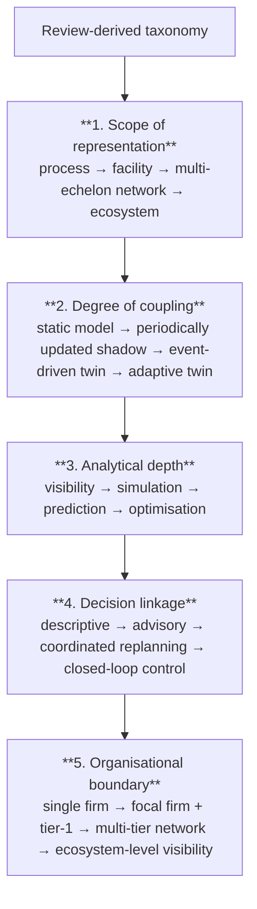

## 1 Introduction
A supply chain usually does not fail in one dramatic moment. Problems build through small mismatches: a delayed supplier, an overloaded warehouse, a drifting forecast, a constrained lane, or a production asset that underperforms without immediate notice. The difficulty is not only correcting these problems; it is detecting them early enough and understanding their downstream effects clearly enough to act well.  
&nbsp;

  
This is one reason the idea of the digital twin has attracted so much attention. In its strongest form, a digital twin is more than a one-off simulation model and more than a reporting dashboard. It is a connected digital representation of a physical system that can support monitoring, explanation, scenario testing, prediction, and, in more advanced forms, optimisation and corrective action [2, 3]. The concept emerged in engineering settings, particularly where the life of a complex asset needed to be mirrored closely enough to support maintenance and risk decisions [3]. It has since travelled into manufacturing, logistics, healthcare, energy, and supply-chain management.  

For supply chains, the attraction is obvious. A supply chain is a system of systems: suppliers, plants, warehouses, transport assets, inventories, orders, ports, carriers, retailers, and customers. Each element changes over time, often under uncertainty. Traditional planning tools are useful, but they are often static compared with the conditions they are meant to manage. A digital twin offers a more dynamic alternative. It can combine current data with models of behaviour and constraints, allowing managers to test actions before imposing them on the real network [5, 11].   

Yet the term is frequently overused. Several recent reviews caution that many so-called digital twins in supply chains are closer to digital shadows, limited visibility platforms, or disconnected simulation models than to true twins with strong feedback and decision capability [1, 11]. That gap between promise and implementation is important both academically and practically. If the concept remains vague, the literature risks becoming descriptive rather than cumulative, and firms risk buying systems that improve presentation more than decisions.   
&nbsp;

This article therefore has four aims. First, it clarifies the concept of the digital twin for the supply- chain context. Second, it explains where the technology creates operational value, especially for planning, disruption management, and optimisation. Third, it identifies the main technical and organisational barriers that prevent many initiatives from reaching operational maturity. Fourth, it outlines a more realistic path for both researchers and practitioners, based on staged capability building rather than inflated claims.  
&nbsp;

The article is designed as a focused review and synthesis rather than a formal systematic review. It draws on foundational definitions, review papers, and recent supply-chain-focused studies to answer a practical question: under what conditions does a digital twin improve supply-chain decisions, and what usually prevents that improvement from materialising?  
&nbsp;

## 2 From concept to supply-chain context  
&nbsp;

### 2.1 What is a digital twin?  

The most useful starting point is the three-part view popularised by Grieves and developed further in engineering practice: a physical system, a virtual representation, and the information links connecting them [4]. NASA’s influential formulation adds high-fidelity modelling, historical records, fleet data where relevant, and simulation that is rich enough to “mirror the life” of the physical counterpart [3]. Across later reviews, several common features appear repeatedly: continuity of data exchange, representation of system state and behaviour, and the ability to support forward-looking analysis rather than simple record keeping [1, 2].  
&nbsp;

These features matter because not every digital model is a digital twin. A dashboard that displays shipment status is not automatically a twin. A simulation model built for a one-off network redesign is not automatically a twin. A reporting layer sitting on top of enterprise data is not automatically a twin. The distinguishing feature is not visual sophistication but functional connection to the physical system over time.  
&nbsp;

### 2.2 Digital model, digital shadow, and digital twin  

A useful distinction in the recent literature separates digital models, digital shadows, and digital twins [1]. A digital model is a representation without automated data exchange. A digital shadow updates from the physical system but may support only one-way or weakly interactive coupling. A digital twin, in the stronger sense, supports richer feedback, allowing the virtual system not only to reflect operations but also to inform or alter them. This distinction is especially important in supply chains because many implementations remain partial. They connect some data sources and support some scenario analysis, but they do not yet create closed-loop or near-closed-loop decision support across the network. That does not make them useless. On the contrary, a capable digital shadow may already improve visibility and planning. But the distinction matters when the literature claims resilience gains, optimisation gains, or autonomy that the underlying system may not yet support.  
&nbsp;

### 2.3 Why supply chains are a natural but difficult application  

Supply chains are a natural setting for digital twins because they are dynamic, interdependent, and data-rich. They are also difficult because the relevant data does not belong to a single machine or a single business function. It is scattered across enterprise resource planning systems, warehouse management systems, transport systems, supplier portals, sensor streams, and external sources such as weather, regulation, or port conditions [7 , 11]. In addition, the physical system itself is partly outside the focal firm’s control. A supply-chain twin therefore faces a broader integration problem than an asset twin inside a single plant.  
&nbsp;

This helps explain why the literature on supply-chain digital twins has grown quickly but remains uneven. Reviews identify strong interest in the concept, but also recurring concerns about interoperability, governance, real-time synchronisation, external data sharing, and the gap between pilot studies and routine use [10, 11].  
&nbsp;

## 3 A reference architecture for supply-chain digital twins  

&nbsp;

Figure 1 presents a simple reference architecture. It is not meant as a full technical standard. Instead, it highlights the layers that repeatedly appear in the literature and in practice-oriented accounts.  
&nbsp;

The first layer is the physical network: assets, inventories, orders, capacities, and flows. The second is the data and integration layer. This is where many projects succeed or fail, because the twin’s usefulness depends on the timeliness, consistency, and semantic clarity of incoming data. The third layer is the twin itself. This includes the state representation, process logic, constraints, simulation models, predictive modules, and optimisation routines. The fourth layer translates insight into action through alerts, scenario analysis, and decision support.  
&nbsp;

The key point is that a digital twin is not one piece of software. It is an architecture that combines data pipelines, models, and managerial interfaces. Reviews repeatedly cite enabling technologies such as IoT, cloud infrastructure, simulation, machine learning, cyber-physical systems, and integration middleware [2 , 11]. But the business value comes from how these pieces are combined around a decision problem.

## 4 Where digital twins create value in supply chains  
&nbsp;

### 4.1 Visibility and situational awareness  

The first and often earliest benefit is improved visibility. A twin can consolidate data from dispersed systems and make the current state of the network more legible. This includes stock positions, shipment states, queue conditions, asset availability, and exception events. In fragmented environments, this alone may create value because planners often work with delayed or inconsistent views of the network [5, 11].  
&nbsp;

However, visibility alone should not be mistaken for optimisation. Many projects stop at the point where they can observe the network more clearly. That is useful, but it does not yet exploit the fuller promise of the twin.  
&nbsp;

### 4.2 Scenario analysis and planning  

A stronger use case is scenario analysis. Because the twin holds a digital representation of constraints and flows, it can test alternatives before they are implemented physically. Examples include changing safety-stock rules, rerouting flows, altering sourcing allocations, adjusting production priorities, or stress-testing disruption responses [9 , 10]. This is especially valuable where decisions have network effects and where physical trial-and-error is expensive or risky.  
&nbsp;

The planning value of the twin lies in reducing the distance between current state and modelled future state. Traditional planning often freezes assumptions and then generates plans that reality quickly invalidates. A twin can shorten that gap by updating the state representation more frequently and by allowing planners to compare policies under present conditions rather than under stale assumptions.  
&nbsp;

### 4.3 Prediction  

Prediction extends scenario analysis by estimating likely near-future states such as stockouts, bottlenecks, lead-time slippage, temperature excursions, or service degradation. Recent reviews note that predictive modules in supply-chain twins often draw on machine learning, simulation, statistical forecasting, or hybrid methods [6, 11]. The twin is useful here because prediction is not performed in isolation; it is tied to a representation of network structure and constraints.  
&nbsp;

This helps avoid a common problem in analytics programmes: predictions are generated, but the operational consequences are hard to trace. In a twin, the predicted event can be located within the network and linked to feasible responses.  
&nbsp;

### 4.4 Optimisation and decision support  

The highest-value use case is optimisation. Here the twin does more than depict or forecast. It helps choose among alternatives. This may include inventory reallocation, capacity balancing, dynamic scheduling, sourcing changes, routing adjustments, or revised priority rules. The literature increasingly frames digital twins as decision-support structures rather than as advanced visualisation tools [1, 9].  
&nbsp;

That framing matters. The twin’s central purpose is not to create a digital copy for its own sake. It is to improve decisions in the face of complexity, uncertainty, and interdependence. A supply-chain twin justifies its cost when it changes actions in ways that improve service, cost, robustness, or speed of response.  
&nbsp;

## 5 Digital twins and supply-chain optimisation  

Supply-chain optimisation traditionally relies on mathematical programming, heuristics, simulation, and increasingly data-driven methods. The twin does not replace these methods. Instead, it provides an environment in which they can work against a more current and structured picture of reality.  
&nbsp;

This relationship can be understood in three ways. First, the twin supplies state information to optimisation routines. Second, it provides a controlled environment for testing candidate actions. Third, it helps evaluate trade offs under changing conditions. This is especially relevant when cost must be balanced against service and resilience rather than optimised in isolation.  
&nbsp;

### 5.1 Inventory and replenishment  

One practical use case is inventory and replenishment management. A twin can support decisions about where to position stock, how much to hold, and when to shift replenishment policies under changing demand and lead-time conditions. This matters because inventory decisions are path-dependent: a late response to a disruption may create shortages at one node and excess at another. By simulating demand shifts and lead-time shocks, a twin can help test whether policy changes reduce overall risk rather than merely moving it.  
&nbsp;

### 5.2 Production and capacity balancing  

In manufacturing-centred supply chains, capacity bottlenecks and sequence-dependent constraints often dominate performance. A twin can represent these constraints more explicitly than aggregate planning models do. This creates value for short-horizon scheduling, bottleneck detection, and the evaluation of alternatives such as overtime, outsourcing, or priority changes [8 ]. The benefit is not only a better schedule, but a better understanding of how local changes propagate through the broader supply network.  
&nbsp;

### 5.3 Transport and disruption response  

Transport planning is another area where a twin can support optimisation, especially when route feasibility and delivery promises are affected by disruptions. By combining live or near-live event streams with network models, the twin can estimate which orders are at risk and compare alternative recovery actions. Reviews on resilience frequently emphasise this ability to absorb operational shocks through faster diagnosis and better response design [10].

## 6 Resilience, risk, and the value of stress testing  

In many sectors, optimisation can no longer be defined only as cost minimisation. Recent years have made clear that the cheapest plan may be the most brittle plan. This has shifted attention toward resilience: the ability to anticipate, absorb, recover from, and adapt to disruptions.  
&nbsp;

Digital twins are promising in this context because they support stress testing. A network can be exposed virtually to delays, capacity loss, demand shocks, supplier failure, or asset degradation. Managers can then compare the effects of alternative buffers, sourcing policies, transport substitutions, or production rules before acting [5 , 10]. In this sense, the twin becomes a resilience laboratory embedded in day-to-day operations.  
&nbsp;

At the same time, the literature warns against assuming that all twins deliver resilience automatically. Benhamou et al. argue that many applications still lack the closed-loop maturity implied by the term “digital twin”; in many cases, the implementation supports monitoring and some analysis but not strong corrective capability [1]. This caution is useful. Resilience gains depend on what the twin can actually do, not on what the label suggests.  
&nbsp;

## 7 Why implementation is difficult  

If the concept is attractive, why are mature supply-chain twins still relatively rare? The answer lies in several recurring barriers.  
&nbsp;

### 7.1 Integration across systems and firms  

The first barrier is integration. Supply chains cross organisational boundaries, and the data needed to model them is distributed across many systems. Reviews repeatedly identify interoperability and external data sharing as major obstacles [7, 11]. A twin that sees only the focal firm’s internal processes may still be useful, but it cannot support full network optimisation.  
&nbsp;

### 7.2 Synchronisation and data quality  

The second barrier is synchronisation. The more the twin aims to support near-real-time decision-making, the more it depends on timely, trustworthy updates. Missing timestamps, inconsistent identifiers, delayed events, and poor master data can undermine the twin more quickly than weak analytics can. In many projects, data quality work turns out to be less glamorous but more decisive than modelling sophistication.  
&nbsp;

### 7.3 Model scope and fidelity  

A third barrier concerns model scope and fidelity. A useful twin must be detailed enough to capture the constraints that matter, but simple enough to update and interpret. Excessive simplification creates false confidence. Excessive complexity creates fragility and maintenance burden. The literature offers no single correct level of detail, but it consistently suggests that fit to decision purpose is more important than maximal detail [2, 8].  
&nbsp;

### 7.4 Governance and trust  

A fourth barrier is organisational. Even a technically sound twin may fail if planners do not trust it, if responsibilities are unclear, or if no process exists for turning recommendations into decisions. A twin enters existing workflows, incentives, and power structures. Without governance, the result may be a demonstration tool rather than an operational asset.  
&nbsp;

## 8 A staged path toward operational maturity  

Because the gap between aspiration and reality is often large, a staged view is more useful than a binary one. Based on the literature, five capability stages can be sketched:  
&nbsp;

1. Data visibility: core operational data is integrated well enough to describe current conditions.  

2. Digital shadow: the digital representation updates from the physical system and supports monitoring.  

3. Scenario-capable twin: the model supports structured what-if analysis tied to current state.  

4. Predictive twin: the twin estimates near-future risks and performance under plausible scenarios.  

5. Decision-support twin: the twin recommends or helps trigger policy changes, re-planning, or control actions.  

Many organisations may create substantial value without reaching the final stage. This is a useful message for practice because it discourages all-or-nothing thinking. It is also useful for research because it suggests clearer maturity markers than the broad term “digital twin” alone.  
&nbsp;

## 9 Implications for research  

For academic work, three implications follow.  
&nbsp;

First, definitions must be tighter. Papers should distinguish clearly between static simulation, digital shadows, and stronger forms of twins. Without this, findings across studies are difficult to compare.  
&nbsp;

Second, evaluation designs need to improve. Much of the literature remains conceptual, demonstrative, or limited to pilot settings [10, 11]. More evidence is needed on performance outcomes under comparable conditions: service level, lead time, inventory, cost, and disruption recovery.  
&nbsp;

Third, optimisation deserves deeper treatment. The current literature often states that digital twins improve decisions, but gives less attention to the optimisation logic itself: what objective functions are used, how constraints are represented, and under what conditions the twin changes decisions better than conventional planning tools.  
&nbsp;

## 10 Implications for practice

For practitioners, the main lesson is to begin with a decision problem rather than a software label. Useful starting questions include: Which decision is currently slow, brittle, or poorly informed? What data is needed to represent that problem adequately? What actions would the organisation actually take if the twin produced a credible recommendation?  
&nbsp;

A narrow, high-value use case is usually better than a broad and ambiguous one. Examples include early warning for cold-chain excursions, short-horizon capacity balancing in a constrained plant network, or disruption response for a critical lane. Success in such areas can justify broader expansion later.  
&nbsp;

Practitioners should also avoid treating the twin as a visual layer added after the fact. The enduring value comes from connecting data, model, and action. A system that improves the appearance of control without improving the quality or speed of decisions is unlikely to justify long-term investment.  
&nbsp;

## 11 Conclusion

Digital twins matter in supply-chain optimisation because they offer a way to connect current state, model-based reasoning, and action within a single operational structure. Their value does not lie in the novelty of the label, nor in visualisation alone, but in their ability to help managers test options before changing the physical system.  
&nbsp;

The literature suggests both promise and restraint. There is good reason to view digital twins as a significant development in planning, resilience, and decision support. There is also good reason to resist inflated claims. Many implementations remain partial, and many benefits depend less on sophisticated analytics than on integration, governance, and the discipline to define a clear decision purpose.  
&nbsp;

For research, the next step is not more broad enthusiasm but stronger cumulative evidence: better definitions, sharper maturity models, and more direct tests of operational impact. For practice, the next step is not to ask whether a company has a digital twin, but whether it has built a connected model that materially improves important decisions. That is the standard that matters.  
&nbsp;

## References

[1] Léa Benhamou, Vincent Giard, and Samir Lamouri. Digital twins in supply chain manage- ment: Scope and methodological issues. International Journal of Production Economics, 291:109842, 2026. doi: 10.1016/j.ijpe.2025.109842.  

[2] Peipei Ding et al. A review of digital twins in smart industries: Concepts, reference models, applications and standards. Information Fusion, 118:102874, 2026. doi: 10.1016/j.inffus. 2025.102874.  

[3] Erik H. Glaessgen and David S. Stargel. The digital twin paradigm for future nasa and u.s. air force vehicles. In 53rd AIAA/ASME/ASCE/AHS/ASC Structures, Structural Dynamics and Materials Conference, 2012. doi: 10.2514/6.2012-1818.  

[4] Michael Grieves. Digital twin: Manufacturing excellence through virtual factory replication. Florida Institute of Technology, 2014. White paper.  

[5] Yiran Huang, Chang Liu, and Jian Yang. Implementation of digital twins in the food supply chain: A review and conceptual framework. International Journal of Production Research, 62(17):6400–6426, 2024. doi: 10.1080/00207543.2024.2318292.

[6] Sachin S. Kamble, Angappa Gunasekaran, H. M. J. Jabbour, and Shradha Belhadi. Digital twin for sustainable manufacturing supply chains: Current trends, future perspectives, and an implementation framework. Technological Forecasting and Social Change, 176:121448, 2022. doi: 10.1016/j.techfore.2021.121448.

[7] Marlon Koot et al. A systematic literature review of supply chain decision making supported by the internet of things and big data analytics. Computers & Industrial Engineering, 154: 107076, 2021. doi: 10.1016/j.cie.2021.107076.

[8] Antônio Augusto F. Neto et al. Modeling production disorder: Procedures for digital twins design, implementation, and use. International Journal of Production Economics, 261: 108873, 2023. doi: 10.1016/j.ijpe.2023.108873.

[9] Hector Daniel Perez et al. A digital twin framework for online optimization of supply chains business processes. Computers & Industrial Engineering, 174:108716, 2022. doi: 10.1016/j.cie.2022.108716.

[10] Eduardo A. Román et al. State of the art of digital twins in improving supply chain resilience. Logistics, 9(1):22, 2025. doi: 10.3390/logistics9010022.

[11] Syed Ahmad Hassan Zaidi, Abderrahman Chaabane, Mahen Doolun, and Naceur Ben Khedher. Unlocking the potential of digital twins in supply chains: A systematic review. Supply Chain Analytics, 7:100075, 2024. doi: 10.1016/j.sca.2024.100075.
